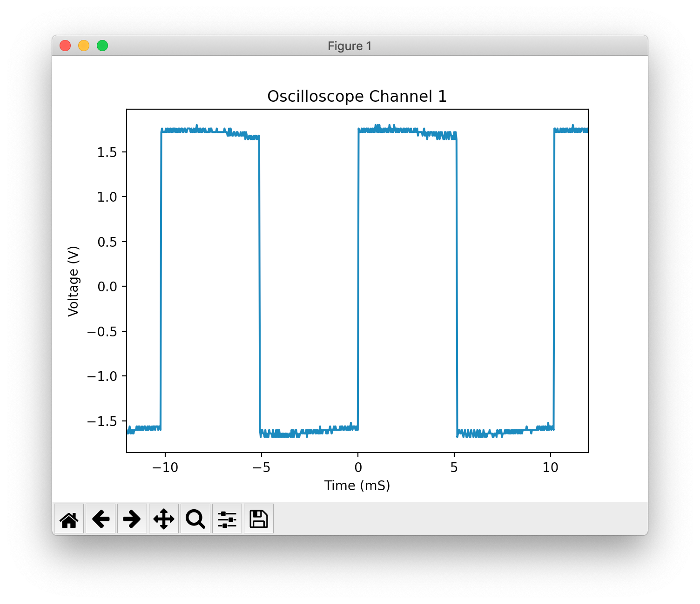

# rigol-interface

A programatic python interface for controlling and collecting data
from the Rigol DS1052E oscilloscope.

# Setup

## macOS

*(assuming `python` and `pip` are mapped to Python3 binaries)*

First, install `libusb` via Homebrew:

```
$ brew install libusb
```

Then, install `pyusb` and `python-usbtmc` via `pip`:

```
$ pip install pyusb python-usbtmc
```

# Use

Running `./scope.py` will display the current screen of the scope,
presented as a labeled Matplotlib plot:



# Credits

My code is heavily based on Ken Shiriff's
[code](http://righto.com/rigol) which was in turn based on
[code](https://www.cibomahto.com/2010/04/controlling-a-rigol-oscilloscope-using-linux-and-python/)
by Cibo Mahto.